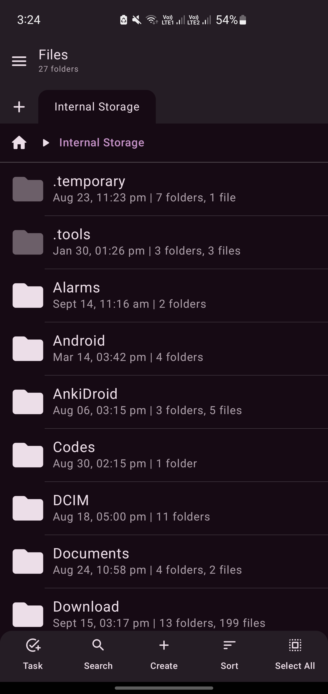
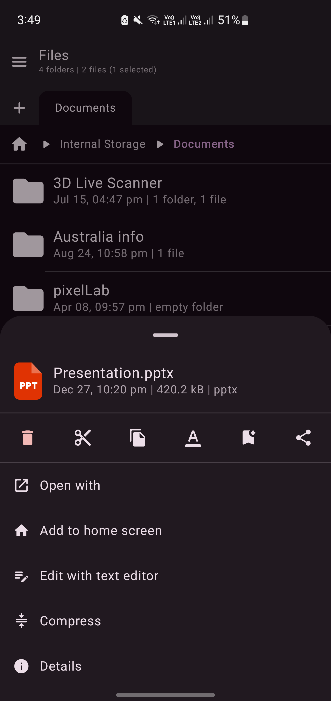
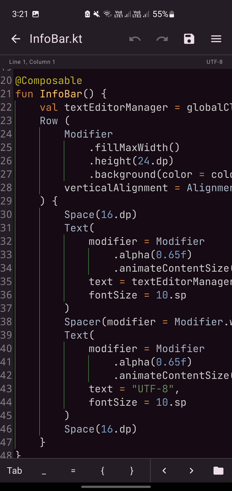

# File Explorer Compose

  
  
  

**A modern, feature-rich, and lightweight file manager for Android, built entirely with Kotlin and Jetpack Compose.**

## Introduction

File Explorer Compose is a free, open-source file management application designed for Android. It leverages the power of Jetpack Compose to deliver a smooth, modern, and intuitive user interface.

## Key Features

*   **Clean and Modern UI:**  Declarative and responsive user interface built with Jetpack Compose.

*   **Comprehensive File Management:**  Perform all essential file operations including:
    *   Browsing directories and files
    *   Creating new folders and files
    *   Copying, moving, renaming, and deleting files and folders
    *   Cut, copy, and paste functionality
    *   Archiving and extracting files (Zip, etc.)
*   **Multi-Tab Interface:**  Managing files across multiple tabs simultaneously, simplifying complex file operations and navigation.
*   **Built-in Media Viewers:**  Directly preview various media formats within the app:
    *   Images (JPEG, PNG, GIF, etc.)
    *   Videos (MP4, AVI, MKV, etc.)
    *   Audio (MP3, WAV, FLAC, etc.)
    *   PDF Documents
*   **Text Editor:**  View and edit text-based files directly within the file explorer.
*   **Lightweight and Efficient:**  Designed for optimal performance and minimal resource usage, ensuring a smooth experience even on lower-end devices.
*   **Open Source & Free:**  Completely free to use, under the GPLv3 license. No ads, tracking, or hidden costs.

## Screenshots

  
  
  

## Download and Installation

You can download the latest version of File Explorer Compose through the following:

*   **GitHub Releases:**  Download the APK directly from the [Releases page](https://github.com/Raival-e/File-Explorer-Compose/releases). This is the most direct way to get the app.

*   **Obtainium:**  File Explorer Compose is also available on Obtainium.

<a href='https://apps.obtainium.imranr.dev/redirect?r=obtainium://app/%7B%22id%22%3A%22com.raival.compose.file.explorer%22%2C%22url%22%3A%22https%3A%2F%2Fgithub.com%2FRaival-e%2FFile-Explorer-Compose%22%2C%22author%22%3A%22Raival-e%22%2C%22name%22%3A%22File%20Explorer%22%2C%22preferredApkIndex%22%3A0%2C%22additionalSettings%22%3A%22%7B%5C%22includePrereleases%5C%22%3Afalse%2C%5C%22fallbackToOlderReleases%5C%22%3Atrue%2C%5C%22filterReleaseTitlesByRegEx%5C%22%3A%5C%22%5C%22%2C%5C%22filterReleaseNotesByRegEx%5C%22%3A%5C%22%5C%22%2C%5C%22verifyLatestTag%5C%22%3Afalse%2C%5C%22dontSortReleasesList%5C%22%3Afalse%2C%5C%22useLatestAssetDateAsReleaseDate%5C%22%3Afalse%2C%5C%22releaseTitleAsVersion%5C%22%3Afalse%2C%5C%22trackOnly%5C%22%3Afalse%2C%5C%22versionExtractionRegEx%5C%22%3A%5C%22%5C%22%2C%5C%22matchGroupToUse%5C%22%3A%5C%22%5C%22%2C%5C%22versionDetection%5C%22%3Atrue%2C%5C%22releaseDateAsVersion%5C%22%3Afalse%2C%5C%22useVersionCodeAsOSVersion%5C%22%3Afalse%2C%5C%22apkFilterRegEx%5C%22%3A%5C%22%5C%22%2C%5C%22invertAPKFilter%5C%22%3Afalse%2C%5C%22autoApkFilterByArch%5C%22%3Atrue%2C%5C%22appName%5C%22%3A%5C%22%5C%22%2C%5C%22shizukuPretendToBeGooglePlay%5C%22%3Afalse%2C%5C%22allowInsecure%5C%22%3Afalse%2C%5C%22exemptFromBackgroundUpdates%5C%22%3Afalse%2C%5C%22skipUpdateNotifications%5C%22%3Afalse%2C%5C%22about%5C%22%3A%5C%22%5C%22%7D%22%2C%22overrideSource%22%3Anull%7D'></a>

*   **IzzyOnDroid F-Droid Repository:**  Available on IzzyOnDroid for users who prefer F-Droid compatible repositories.

**Note:**  When installing from APK, you will need to manually update the app. Consider using Obtainium or IzzyOnDroid for automatic updates.

## Built With

*   **[Kotlin](https://kotlinlang.org/)**:  Primary programming language for Android development.
*   **[Jetpack Compose](https://developer.android.com/jetpack/compose)**:  Modern UI toolkit for building native Android UIs.
*   **[Android SDK](https://developer.android.com/sdk)**:  For Android platform compatibility.

## Contributing

Contributions are welcome! If you'd like to contribute to File Explorer Compose, please consider the following:

*   **Bug Reports:**  If you encounter any issues, please [open an issue](https://github.com/Raival-e/File-Explorer-Compose/issues) on GitHub describing the problem in detail.
*   **Feature Requests:**  Have a great idea for a new feature?  Submit a [feature request issue](https://github.com/Raival-e/File-Explorer-Compose/issues/new?assignees=&labels=enhancement&template=feature_request.md&title=Feature+Request%3A+) to share your suggestions.
*   **Code Contributions:**  Fork the repository, create a branch for your changes, and submit a pull request. Please follow the project's coding style.

## License

This project is licensed under the **[GNU General Public License v3.0](https://www.gnu.org/licenses/gpl-3.0)**. See the [LICENSE](LICENSE) file for more details.

## Contact

For any questions or support, you can:

*   [Open an issue](https://github.com/Raival-e/File-Explorer-Compose/issues) on GitHub.
