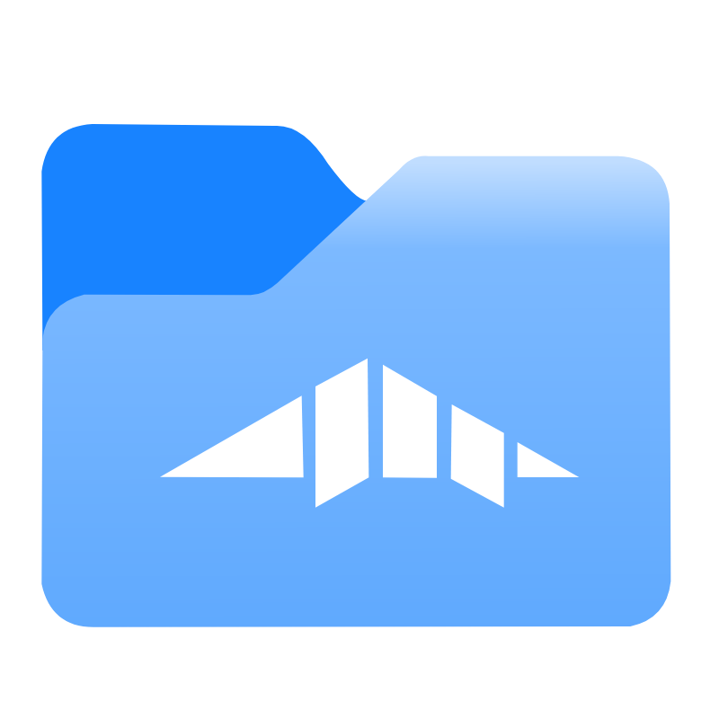
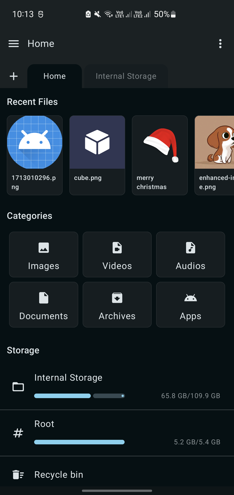
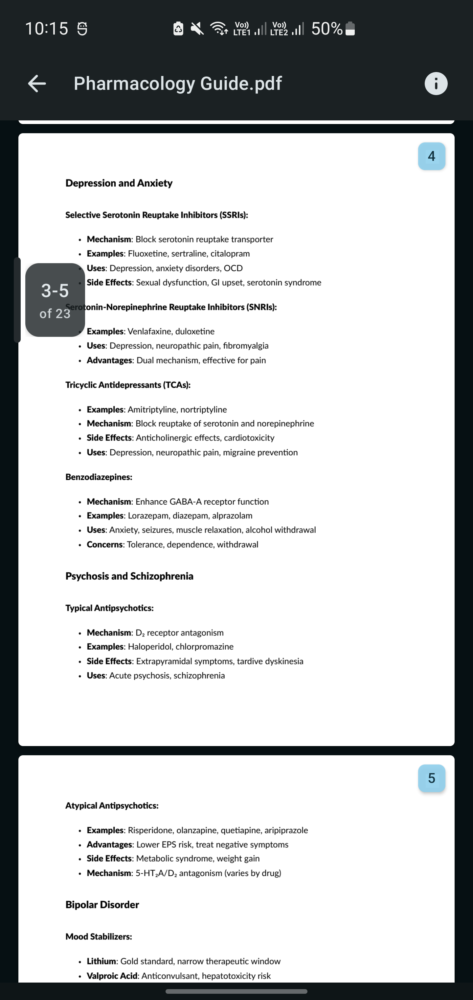

<div align="center">



# Prism File Explorer

[](https://www.android.com/)
[](https://www.gnu.org/licenses/gpl-3.0)
[](https://github.com/Raival-e/Prism-File-Explorer/releases)
[](https://github.com/Raival-e/Prism-File-Explorer/releases)
[](https://github.com/Raival-e/Prism-File-Explorer/stargazers)
[](https://github.com/Raival-e/Prism-File-Explorer/network/members)

**A modern, feature-rich, and lightweight file manager for Android, built entirely with Kotlin and Jetpack Compose.**

*Delivering a seamless file management experience with a beautiful Material Design interface*

</div>

---

## 📱 Screenshots

<div align="center">
  
  
  
  
</div>

<div align="center">
  
  
  
</div>

---

## ✨ Key Features

### 🎨 **Modern User Interface**

- **Jetpack Compose UI**: Fully declarative and responsive interface
- **Material Design 3**: Beautiful, consistent design language
- **Dark/Light Theme**: Automatic theme switching support
- **Smooth Animations**: Fluid transitions and interactions

### 📁 **Comprehensive File Management**

- **Complete File Operations**: Create, copy, move, rename, delete files and folders
- **Advanced Selection**: Multi-select with intuitive gestures
- **Smart Cut/Copy/Paste**: Clipboard operations with visual feedback
- **Batch Operations**: Perform actions on multiple files simultaneously
- **File Properties**: Detailed information about files and directories

### 🗂️ **Advanced Features**

- **Multi-Tab Interface**: Manage multiple directories simultaneously
- **Quick Navigation**: Breadcrumb navigation and quick access shortcuts
- **Search Functionality**: Find files and folders quickly
- **Sorting Options**: Sort by name, size, date, type with ascending/descending order
- **View Modes**: Grid and list view options

### 📺 **Built-in Media Viewers**

- **Image Viewer**: Support for JPEG, PNG, GIF, WebP, and more
- **Video Player**: Play MP4, AVI, MKV, MOV, and other formats
- **Audio Player**: MP3, WAV, FLAC, OGG playback support
- **PDF Viewer**: View PDF documents natively
- **Text Editor**: Syntax highlighting for code files

### 🗜️ **Archive Management**

- **Extract Archives**: Support for ZIP format
- **Create Archives**: Compress files and folders into ZIP format
- **Archive Preview**: Browse archive contents without extraction

### ⚡ **Performance & Efficiency**

- **Lightweight**: Minimal resource usage and fast startup
- **Optimized**: Smooth performance on low-end devices
- **Background Operations**: Non-blocking file operations
- **Memory Efficient**: Smart memory management for large directories

---

## 📥 Download Options

| Platform            | Link                                                                                                                                                                                                                                                                                                                                                                        |
|---------------------|-----------------------------------------------------------------------------------------------------------------------------------------------------------------------------------------------------------------------------------------------------------------------------------------------------------------------------------------------------------------------------|
| **GitHub Releases** | [](https://github.com/Raival-e/Prism-File-Explorer/releases)                                                                                                                                                                                                                   |
| **IzzyOnDroid**     | [](https://apt.izzysoft.de/fdroid/index/apk/com.raival.compose.file.explorer)                                                                                                                                                                                                    |
| **Obtainium**       | [](https://apps.obtainium.imranr.dev/redirect?r=obtainium://app/%7B%22id%22%3A%22com.raival.compose.file.explorer%22%2C%22url%22%3A%22https%3A%2F%2Fgithub.com%2FRaival-e%2FPrism-File-Explorer%22%2C%22author%22%3A%22Raival-e%22%2C%22name%22%3A%22File%20Explorer%20Compose%22%7D) |
| **OpenApk**         | [](https://www.openapk.net/file-explorer/com.raival.compose.file.explorer/)                                                                                                                                                                                                   |

### 📋 System Requirements

- **Android Version**: 6.0 (API 23) or higher
- **Permissions**: Storage access for file management

---

## 🛠️ Built With

| Technology                                                                                                               | Purpose                  | Version       |
|--------------------------------------------------------------------------------------------------------------------------|--------------------------|---------------|
|                              | **Programming Language** | Latest        |
|  | **UI Framework**         | Latest Stable |
|                           | **Platform**             | SDK 34+       |
|  | **Design System**        | Material 3    |


---

## 🔨 Building from Source

### Prerequisites

- **JDK**: 17 or higher
- **Android SDK**: API level 34+
- **Git**: For cloning the repository

### Build Instructions

1. **Clone the repository**:
   ```bash
   git clone https://github.com/Raival-e/Prism-File-Explorer.git
   cd Prism-File-Explorer
   ```

2. **Build the project**:
   ```bash
   ./gradlew assembleRelease
   ```

3. **Find the APK**:
    - Generated APK will be in `app/build/outputs/apk/release/`

### Release Information

Official releases are built using **Android Studio** with **JetBrains Runtime 21.0.6**.

---

## 🤝 Contributing

1. **Fork** the repository
2. **Create** a feature branch (`git checkout -b feature/amazing-feature`)
3. **Commit** your changes (`git commit -m 'Add amazing feature'`)
4. **Push** to the branch (`git push origin feature/amazing-feature`)
5. **Open** a Pull Request

### 📝 **Development Guidelines**

- Follow Kotlin coding conventions
- Write meaningful commit messages

---

## 📊 Project Stats


---

## ☕ Support the Project

If you find **Prism File Explorer** useful and would like to support its development, consider
buying me a coffee! Your support helps me maintain and improve this project.

[](https://www.buymeacoffee.com/RaivalR)

*Every contribution, no matter how small, helps keep this project alive and growing! ❤️*

---

## 📄 License

This project is licensed under the **GNU General Public License v3.0**.

```
Prism File Explorer - A modern Android file manager
Copyright (C) 2024 Raival-e

This program is free software: you can redistribute it and/or modify
it under the terms of the GNU General Public License as published by
the Free Software Foundation, either version 3 of the License, or
(at your option) any later version.
```

See the [LICENSE](LICENSE) file for the full license text.

---

## 💬 Support & Community

| Platform               | Purpose                       |
|------------------------|-------------------------------|
| **GitHub Issues**      | Bug reports, feature requests |
| **GitHub Discussions** | Community support, questions  |
| **Email**              | Private inquiries             |

**⭐ If you find this project useful, please consider giving it a star!**

[](https://github.com/Raival-e/Prism-File-Explorer/stargazers)